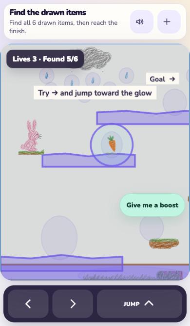
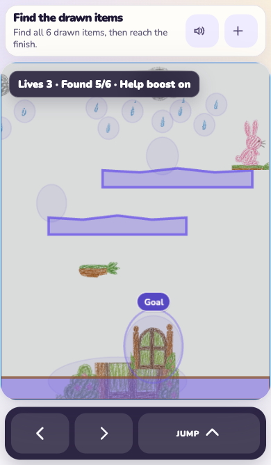

# Inkling

**Draw it on paper. Play it in your browser.**

**▶ Try it now: [inkling-web-production.up.railway.app](https://inkling-web-production.up.railway.app)** — no install, no account. Scan a drawing, or grab one of [our test drawings](docs/Inkling-brief-and-drawings.zip).

Kids draw games all the time — a hero, some spikes, a door you have to reach at
the end. Inkling takes a photo of that drawing and hands back a playable
platformer about a minute later. The art in the game *is* the drawing: every
character is cut straight out of the photo, wobbly lines and all. And no game
is ever shown to a child until a simulated player has beaten it, so a kid never
receives a game they can't win.

Built for OpenAI Build Week with **Codex** and **GPT-5.6**.

<p align="center">
  
  &nbsp;&nbsp;&nbsp;
  
</p>
<p align="center"><em>A real scan: the bunny, carrots, clouds, and goal door are the child's actual crayon marks, cut straight out of the photo.</em></p>

---

## Try it

The fastest way is the live site above. To run it yourself:

```bash
npm install
export OPENAI_API_KEY=sk-...
npm run dev          # browser flow: scan a drawing → play the game
```

No API key handy? Play a game generated from a real live scan:

```bash
npm run play -- examples/live-scan-gamespec.json
```

Or run the whole loop from the command line:

```bash
npm run scan -- /absolute/path/to/drawing.png --out examples/my-gamespec.json --playable-out examples/my-game.json
npm run play -- examples/my-game.json
```

`npm run dry-run` prints every model call (id, model, effort) without touching
the network.

### No drawing handy? Use ours

[`docs/Inkling-brief-and-drawings.zip`](docs/Inkling-brief-and-drawings.zip)
([direct download](https://github.com/sreenathmmenon/inkling/raw/main/docs/Inkling-brief-and-drawings.zip))
contains seven real test drawings — from a toddler's abstract crayon scribble
to an adult's ink-and-watercolor level — plus a three-page technical brief on
how the system works and what was measured. Scan any of them through
`npm run dev` or `npm run scan` to see the full drawing-to-game loop.

## How it works

```
photo of drawing
   │
   ▼
 P1  safety gate ──── can't be skipped; halts the run on failure
   ▼
 P2  drawing → GameSpec (what's a hero, what's a hazard, what winning means)
   ▼
 P3 / P4 / P5  asset fan-out, run concurrently (character rig, background, sound mood)
   ▼
 P6  hard genre inference — only runs when P2 was uncertain
   ▼
 P7  bespoke behavior code, one call per entity
   ▼
 P8  play-test loop: simulate → repair → replay, until the game is beaten
   ▼
playable game, shipped with the evidence that it was actually won
```

The entire flow is declared in **one file, [`spec/pipeline.json`](spec/pipeline.json)** —
13 calls, each a row naming its model, reasoning effort, prompt file, strict
output schema, and dependencies. [`runner/pipeline.ts`](runner/pipeline.ts) is
a single loop over that spec: it resolves dependencies, fans out
`parallel_group`s, honors `run_if`, `loop_until`, `effort_router`,
`escalate_to`, and `blocks_pipeline_on`, and attaches strict Structured
Outputs plus a per-user `safety_identifier` to every request. Model and effort
come **only** from the spec — to change routing you edit data, not code.

## Every game is provably winnable

Nothing is more deflating for a kid than a game that can't be won, so
finishability is enforced, not hoped for. Before each P8 iteration, a
fixed-step simulation plays the game start to finish using the *same* world
dimensions, gravity, jump, collision plan, hazards, lives, collectibles, goal
trigger, and survival timer as the real Phaser player. If the goal can't be
reached, bounded repairs are applied — a platform nudged, a gap closed — and
the game is replayed until P8 rules it ready or the iteration limit is hit.
Generated games carry that play-test evidence with them.

## How GPT-5.6 is used

Every reasoning step in the product runs on GPT-5.6, using the three variants
(`gpt-5.6-sol`, `gpt-5.6-terra`, `gpt-5.6-luna` — aliased `sol` / `terra` /
`luna` in the spec) sized to each job:

| Call | Model · effort | What it does |
|---|---|---|
| P1 | luna · none | Safety gate on every incoming image — mandatory, blocking |
| P0 | luna · none | Looks at the drawing once, cheaply, and calibrates how hard the rest of the pipeline should think |
| P2 / P2_photo | sol · low→medium | The core act: reads a child's drawing and produces a strict GameSpec — entities, physics roles, win condition |
| P3, P4, P5 | terra/luna · low/none | Character rig plan, background plate, sound mood — fanned out concurrently |
| P6 | sol · high | Hard genre inference, invoked only when P2 signals uncertainty |
| P8 | terra · high | Solvability verdict: judges the deterministic play-test trace and drives the repair loop |
| P9, P10 | terra/sol | Voice-edit diffs and multi-page drawing stitching |
| P11 | terra · medium | Share moderation — required before anything can be published |

Three GPT-5.6 techniques carry the product:

- **Effort routing.** P0's cheap first look routes later calls: a simple
  crayon sketch runs P2 at `low`, a dense scene at `medium`. Hard cases
  escalate (`escalate_to`) instead of failing.
- **Strict Structured Outputs everywhere.** All 13 calls emit
  `strict: true` JSON against schemas in `spec/schemas/`;
  `npm run audit:strict` verifies every schema stays inside the subset the
  Responses API accepts.
- **Model-as-judge with receipts.** P8 doesn't trust the generator. It reads a
  deterministic replay trace and rules on it; a game ships only with evidence
  it was legally beaten.

## How Codex is used

Codex shows up twice — once to build the system, and once inside it:

**1. Codex built the runner.** The repo carries its own build instruction in
[`.goal`](.goal) — hand it to the Codex CLI:

```bash
codex exec "$(cat .goal)"
```

(The original build ran on `gpt-5.2-codex` at high reasoning effort.) Codex
reads `.goal`, uses `spec/pipeline.json` as its checklist, materializes
every prompt (`prompts/*.txt`) and schema (`spec/schemas/*.json`) from the
Prompt & Model Engineering Spec PDF, wires `runner/pipeline.ts`, and runs the
self-verification suite before declaring itself done.

**2. Codex writes each game's behavior code at runtime (P7).** Every entity in
a child's drawing gets bespoke behavior generated by `gpt-5.2-codex` — this is
what makes a drawn dragon patrol differently from a drawn cloud. Because it is
model-written code, it is treated as hostile until proven otherwise: modules
are validated statically, then simulated in a Node permission sandbox with no
network, no filesystem writes, no child processes, and no inherited
environment. A module that fails any check falls back to a static behavior and
is never installed.

## Kid-safe by design

The primary player needs **no account**. A child scans a drawing, plays, and
saves the game to their device without typing a name, email, or age — the
client sends only the prepared image crop. A visible **Forget drawing** button
clears the image before it is ever sent or after generation. The server does
not persist drawings or generated games.

- P1 (input safety) and P11 (share moderation) are blocking gates the runner
  cannot skip; `blocks_pipeline_on` halts the run.
- Sharing (`services/share/`) is moderation-only: it demands P8's ready
  verdict *and* replay evidence that the goal was reached before calling P11,
  and it never creates a public link itself.
- The browser never holds an API key; generation goes through a same-origin
  server boundary (`services/gen/`) that requires a server-derived
  64-character safety identifier.
- Public profiles, comments, chat, ads, and searchable galleries are
  intentionally outside the product boundary.

## Repo tour

| Path | What lives there |
|---|---|
| `spec/pipeline.json` | The single source of truth: all 13 model calls as data |
| `prompts/`, `spec/schemas/` | Prompt text and strict output schemas, extracted from the spec PDF — never hardcoded |
| `runner/` | The pipeline loop + PDF extractor that seeds prompts/schemas |
| `packages/runtime` | Deterministic Phaser 4 platformer (Lane A) — no model code, no network |
| `apps/client` | Kid-facing capture + player web app |
| `services/gen`, `services/share` | Server boundaries: generation gate and share moderation |
| `examples/` | Saved GameSpecs from real scans, playable offline |
| `fixtures/validation-drawings/` | Generated test-drawing corpus used by `npm run verify` |

The runtime maps the GameSpec's normalized `0..1` boxes into a fixed 960×540
Arcade Physics world, crops the original photo by each entity's bounds, and
renders those untouched crops over its collision shapes — the drawing is never
redrawn or "improved". Playable documents (`inkling-playable-game-v1`) bundle
the GameSpec, the artwork crops, and the P8 evidence, and load with zero
network access.

## Verify

```bash
npm install
npm run verify
```

`npm run verify` is self-contained from a fresh clone: the prompts, schemas,
and the drawing corpus (`fixtures/validation-drawings/round-1/`) are all
tracked in the repo. (`runner/extract_from_pdf.py` exists to regenerate
`prompts/` and `spec/schemas/` from the Prompt & Model Engineering Spec PDF,
which is not distributed publicly — you never need it to run or verify the
project.) The chain starts with
`npm run typecheck`. Several files in the chain are **intentional review
gates** — each protects a product invariant; a legitimate redesign changes
*how* the property is asserted, never *whether*:

| Gate | Protects |
|---|---|
| `scripts/verify-css-architecture.ts` | Ordered import-only CSS cascade; cross-module overrides diffed against a reviewed baseline |
| `scripts/verify-client-bundle.ts` | Capture shell boots without Phaser; the player stays a lazy chunk |
| `scripts/verify-client-ui.ts` | Real-browser accessibility, layout, contrast, and recovery contracts |
| `scripts/verify-runtime-replay.ts` | Solver and production Phaser runtime agree; idle never wins; assist never tunnels |
| `tests/solvability.test.ts` | Games are provably finishable; sandbox validation holds |
| `tests/runtime-trace.test.ts` | Readiness is earned by a legal replay trace, never claimed |
| `tests/replay-policies.test.ts` | Certification input policies stay deterministic and honest |
| `tests/recast-ladder.test.ts` | Safety recast keeps the child's drawing playable; only the last rung adds synthetic geometry |

`npm run audit:strict` separately validates every schema against the narrower
JSON Schema subset accepted by OpenAI Structured Outputs and fails on any
schema the Responses API would reject.

## Runtime entry points

`runPipeline({ image }, { safetyId })` / `runDrawingScan` run the drawing
workflow; `runPhotoScan` runs the mandatory P1 gate before `P2_photo`.
`runVoiceEdit`, `runMultipageStitch`, and `runShareModeration` cover the
conditional workflows — share moderation requires the passing P8 evidence from
the scan result. The OpenAI client is created lazily from `OPENAI_API_KEY`,
and every outbound request is checked against `pipeline.json` before it is
sent.

## Production deployment

`npm run build:production` compiles the server and Vite client into
`build/client`; `npm start` serves the client bundle and the same-origin
generation API on `0.0.0.0:$PORT`. Production requires `OPENAI_API_KEY` and a
stable random `INKLING_SESSION_SECRET` (≥32 chars) in the host's encrypted
secret store — never in `.env`, client code, logs, or Git. The committed
`railway.json` runs the production build/start, health-checks `/healthz`, and
applies bounded restart/drain behavior. The HTTP boundary uses secure
anonymous session cookies, HTTPS-aware same-origin checks, strict security
headers, bounded uploads, and per-session generation/concurrency limits, and
persists nothing server-side.

The `npm run dev` adapter is intentionally local-only: it derives the safety
identifier by HMAC-ing an opaque `HttpOnly` session cookie server-side. A
production host must replace its session, retention, rate-limit, and
secret-management mechanisms with approved infrastructure, and additionally
provide HTTPS, abuse monitoring, deletion jobs, incident response, and a
reviewed regional privacy program.

### Mobile web now; native app later

The no-account capture/player path is responsive, uses the device camera
chooser, keeps touch targets ≥44 CSS px, respects safe-area insets, and ships
in-game touch controls — a shared link plays in any browser with no install. A
future native app should wrap the same packages (on-device crop, same server
safety boundary, same pipeline, same deterministic player) rather than forking
them.
